# Top 18 Web Scraping Proxy Services Ranked in 2025 (Latest Update)

Scraping data at scale without getting blocked feels like threading a needle while riding a rollercoaster. You need IPs that don't raise red flags, speeds that won't crater your timelines, and pricing that doesn't drain your budget before you've collected a single dataset. The wrong proxy provider turns your data pipeline into a game of whack-a-mole with CAPTCHAs and bans.

Here's the reality: whether you're training AI models, monitoring competitors, or aggregating market intelligence, your proxy infrastructure makes or breaks the operation. We've compiled 18 providers that actually deliver—ranked by reliability, pool depth, geo-targeting precision, and real-world scraping performance across challenging targets like Amazon, Google, and social platforms.

## **[Thordata](https://www.thordata.com)**

High-quality proxy infrastructure purpose-built for AI data collection and large-scale scraping operations.

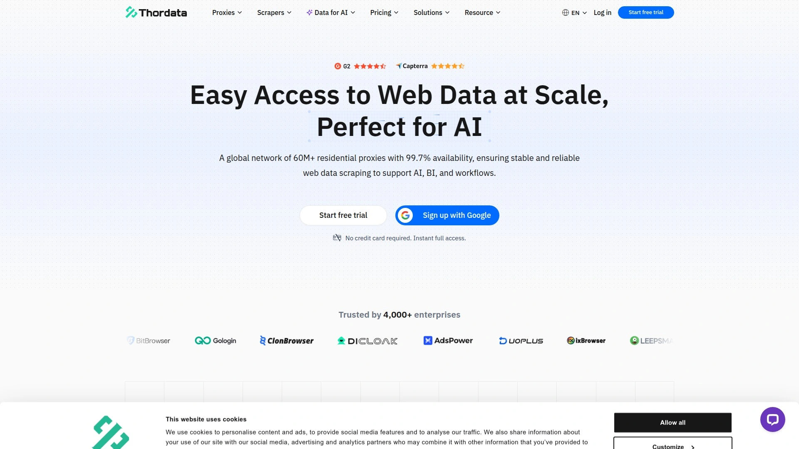

Thordata positions itself as a premium data collection partner with explicit focus on AI and machine learning workloads. Their infrastructure centers on four core proxy types optimized for different scraping scenarios—residential, mobile, ISP, and datacenter—each engineered for specific use cases from human-like browsing patterns to high-throughput bulk extraction.

The residential pool spans 60 million IPs with city-level targeting and automatic rotation every request or sticky sessions when needed. Response times average under 0.5 seconds globally with 99.7% uptime, which translates to minimal retry logic in your scraper code. Mobile proxies tap into real 4G/5G carrier networks across 600,000 devices, particularly valuable for mobile app scraping or platforms that treat mobile traffic differently. ISP proxies deliver unlimited bandwidth per IP at datacenter speeds but with residential trust scores—useful for account-based operations or long-running sessions where you can't afford IP changes mid-task.

Pricing runs $1.80/GB for residential, $2.20/GB for mobile, and $1.50 per IP for both ISP and datacenter options. Traffic doesn't expire on pay-as-you-go plans, so unused allocation rolls forward indefinitely. The dashboard provides proxy format customization, IP whitelisting or username/password auth, and real-time usage analytics. Integration works through standard HTTP/HTTPS/SOCKS5 protocols with straightforward credential strings.

Their compliance stack includes SOC2, GDPR, and CCPA certifications, which matters if you're handling data that touches EU or California residents. Customer testimonials from developers and product managers consistently highlight speed advantages and stable connections even during peak traffic periods.

## **[Oxylabs](https://oxylabs.io)**

Enterprise-grade proxy provider commanding the largest residential IP pool at 175 million addresses.

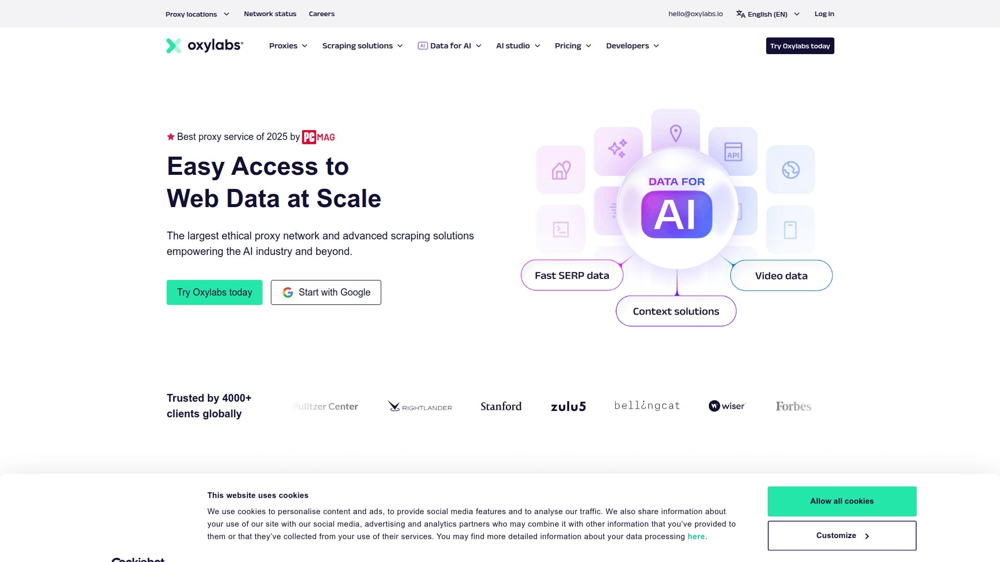

Oxylabs operates one of the most mature proxy infrastructures available, with coverage spanning 195+ countries and granular targeting down to city, ASN, ZIP code, or even GPS coordinates. Their residential proxies achieved 99.82% success rates in independent testing with 0.41-second response times, putting them at the performance frontier. The sheer pool size means lower IP reuse frequency, which directly reduces your block rate on high-security targets.

Beyond raw proxies, Oxylabs packages scraping tools including Web Unblocker (auto-handles CAPTCHAs and retries), SERP APIs, and pre-built scrapers for major ecommerce platforms. This makes sense for teams that want turnkey data pipelines without building retry logic from scratch. They also offer datacenter proxies from $0.90/IP and mobile proxies leveraging 3G/4G/5G networks for mobile-specific scraping.

Pricing starts at $4/GB for residential proxies on pay-as-you-go, dropping to lower per-GB rates on enterprise contracts. They provide dedicated account managers for business plans, which becomes valuable when you're debugging complex scraping workflows or need custom targeting configurations. The 7-day business trial (after contacting sales) or 3-day refund window for individuals gives you testing room before committing.

The downside is cost—Oxylabs sits at the premium end of the market. But for Fortune 500 companies or AI labs needing maximum reliability and scale, the infrastructure investment pays off through reduced maintenance burden and higher data quality.

## **[Bright Data](https://brightdata.com)**

The 800-pound gorilla in proxy services with 175+ million IPs and the most comprehensive tooling ecosystem.

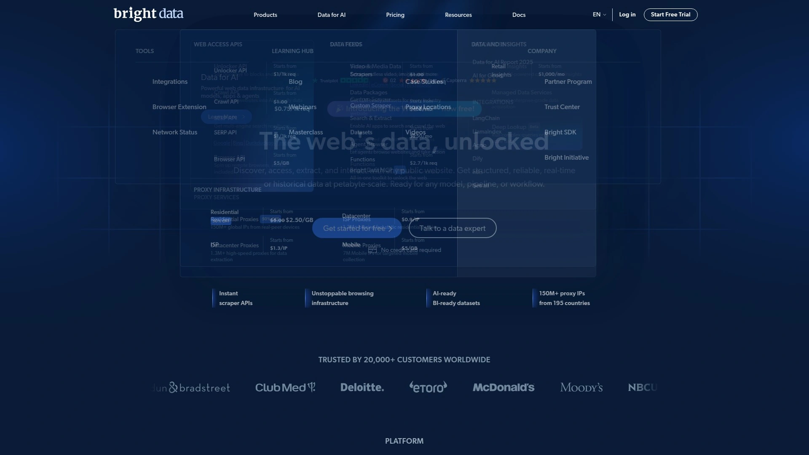

Bright Data pioneered many features now considered standard—precise geo-targeting, sticky sessions, unlimited concurrent connections—and maintains the broadest product suite combining proxies with scraping APIs, browser automation, and pre-collected datasets. Their residential proxy network covers every country with targeting granularity extending to ZIP codes and ASNs. Performance benchmarks show 99.95% uptime with sub-second response times across most geos.

What sets them apart is vertical integration. Need to scrape Amazon product data? They have a dedicated Amazon API. SERP data? Dedicated SERP API. Social media profiles? Specialized social scraping tools. Each abstraction layer handles anti-bot countermeasures, rate limiting, and data parsing, so your team can focus on analysis rather than infrastructure.

Mobile proxies start at $14.40/GB, residential at $4/GB with tiered discounts on volume. Datacenter proxies run $0.90/IP for dedicated addresses or bandwidth-based pricing from $0.60/GB. ISP proxies cost $1.30/IP with static IPs and unlimited bandwidth. The Web Unlocker service starts at $1.30 per 1,000 successful requests, automating CAPTCHA solving and fingerprint rotation.

The complexity is both strength and weakness. Their dashboard offers immense control but comes with a learning curve. Documentation is extensive though sometimes assumes technical familiarity. For enterprise operations with dedicated data engineering teams, Bright Data provides the most comprehensive toolkit available. Smaller teams might find the feature set overwhelming and the pricing structure less transparent than simpler providers.

## **[SOAX](https://soax.com)**

Mid-market favorite balancing performance with competitive pricing across 191+ million ethically-sourced IPs.

SOAX carved out a reputation as the pragmatic choice—reliable infrastructure without premium pricing. Their proxy pool spans 155+ million residential IPs, mobile proxies, USA ISP proxies, and datacenter options, with city and ASN-level targeting across 195 countries. Independent testing shows 98-99.5% success rates on demanding targets like Amazon and Instagram, with response times averaging around one second.

Residential proxies start at $90/month for 25GB ($3.60/GB), scaling down to $2/GB at higher tiers. Pay-as-you-go plans run $4/GB with 12-month validity. A $1.99 trial gets you 400MB for three days—enough to test against your specific targets before committing. Each plan includes unlimited concurrent sessions and 300+ ports on entry tiers, scaling to 1,000+ on enterprise plans.

The dashboard keeps things straightforward with preset locations, custom rotation intervals (5-60 minutes or sticky sessions), and standard HTTP/SOCKS5 protocols. SOAX excels at self-service workflows—you won't get a dedicated account manager on lower tiers, but the interface makes advanced configurations accessible without support tickets. Their recent additions include Web Unblocker APIs and AI-powered scrapers for common targets.

Customer feedback consistently praises support responsiveness and uptime stability. The missing piece is documentation depth—guides cover basics well but lack deep-dive examples for complex scraping patterns. For mid-sized operations needing solid performance without enterprise budgets, SOAX hits a sweet spot.

## **[Decodo (formerly Smartproxy)](https://decodo.com)**

Best value provider with 115 million IPs and award-winning support.

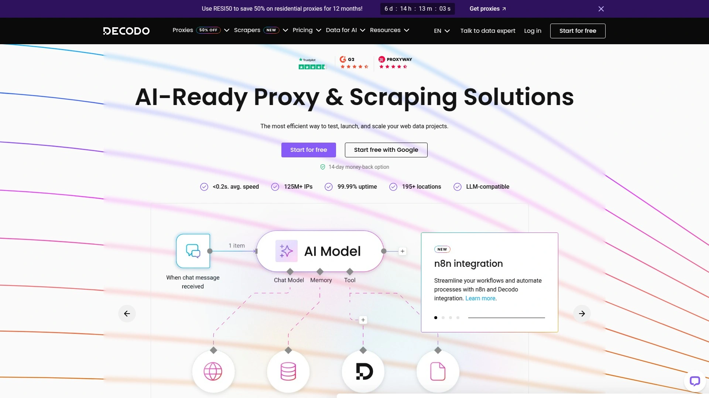

Decodo's 2025 rebrand from Smartproxy signals their shift toward no-code data access tools while maintaining their proxy foundation. The residential network covers 115 million IPs across 195+ countries with country, state, city, ASN, and ZIP code targeting. Performance metrics show 99.86% success rate and 0.63-second response times—solidly competitive with providers charging double.

Pricing starts at $3.50/GB with a 50% discount code (RESI50) available for 12-month plans, effectively bringing cost down to $1.75/GB. Free trials are available on request, and unused traffic rolls over on subscription plans. The sweet spot is their balanced feature set—you get sticky sessions up to 24 hours, SOCKS5 with UDP support, browser extensions, and API documentation without overwhelming complexity.

Their Site Unblocker handles anti-bot systems automatically for $0.95 per 1,000 requests. Scraping APIs cover SERP, ecommerce, social media, and general web scraping from $0.08 per 1,000 requests. Static residential proxies start at $0.27/IP for teams needing consistent addresses without rotation. Mobile proxies begin at $2.25/GB for device-level authenticity.

The killer feature is support quality—they've won awards for 24/7 live chat responsiveness. When your scraper hits unexpected blocks at 2 AM, that matters. Documentation spans quick-start guides to advanced integration examples. For teams prioritizing cost-efficiency without sacrificing reliability, Decodo represents exceptional value.

## **[NetNut](https://netnut.io)**

Residential proxies optimized for large-scale operations with deep US and UK coverage.

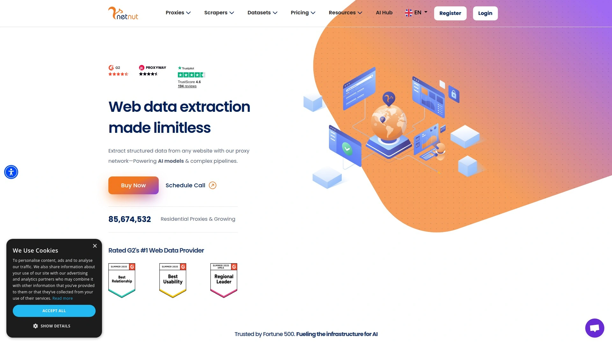

NetNut built their infrastructure around high-volume enterprise needs, particularly strong in premium locations like the United States and UK. The residential pool includes 85 million advertised IPs with country, state, city, and ASN targeting. Their approach emphasizes direct ISP partnerships, resulting in high-trust IPs less likely to appear on blocklists. Performance testing shows 98.40% success rates with 1.22-second response times—middle of the pack on speed but rock-solid on reliability.

Pricing starts at $99 for 28GB ($3.45/GB) with a 7-day free trial for companies. Volume discounts scale aggressively, making NetNut increasingly competitive at higher usage tiers. The dashboard provides detailed analytics including success rate, response time, and connection errors per request—valuable when diagnosing scraping bottlenecks. You can rotate IPs every request or maintain sessions as long as the IP remains available.

Their datacenter proxy network offers 150,000+ IPs across 200+ locations with unlimited bandwidth and 99.99% uptime guarantees. Mobile proxies leverage 5 million real mobile IPs from 100+ countries on 3G/4G/5G networks. Static residential proxies provide consistent IPs for account-based workflows. The unified platform means you can mix proxy types within a single scraping pipeline.

NetNut lacks some polish—the interface feels utilitarian compared to sleeker competitors, and you'll need to contact sales for custom configurations. But if your priority is raw infrastructure reliability and you operate at scale, their technical foundation delivers.

## **[IPRoyal](https://iproyal.com)**

Budget-friendly option with pay-as-you-go flexibility starting at $1.75/GB.

IPRoyal targets cost-conscious users with straightforward pricing and no long-term commitments. Residential proxies start at $7/GB for small purchases, dropping to $1.75/GB when buying in bulk, with traffic that never expires. This pay-as-you-go model suits projects with variable scraping volume or teams testing proxy infrastructure without subscription lock-in.

The residential pool covers 195+ countries with city-level targeting. Protocols include HTTP and SOCKS5 with unlimited concurrent sessions. Static residential proxies (ISP proxies) cost $2.00/IP with unlimited bandwidth and traffic, useful for maintaining consistent identities across sessions. Datacenter proxies run even cheaper for high-speed, less anonymity-critical tasks.

Performance metrics show IPRoyal delivers respectable success rates on standard targets, though they don't publish the detailed benchmarks larger providers showcase. User reviews consistently mention the value proposition—adequate performance at significantly lower cost than premium alternatives. The dashboard provides basic proxy management, traffic tracking, and authentication configuration without unnecessary complexity.

The tradeoff is self-service orientation. You won't get dedicated account managers or phone support, though email and chat responses are reasonably timely. Documentation covers essentials but lacks the depth enterprise teams might need for sophisticated setups. For startups, individual developers, or anyone operating on tight budgets, IPRoyal makes proxy access financially feasible.

## **[Rayobyte](https://rayobyte.com)**

US-focused provider emphasizing transparent operations and ethical sourcing.

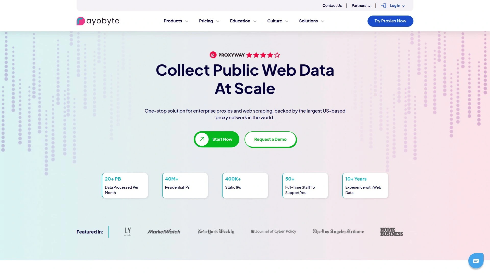

Rayobyte, formerly Blazing SEO, operates as the leading US-based proxy supplier with emphasis on transparency and integrity. Their residential proxy pool includes 36 million IPs with country, state, and city targeting. Pricing runs $15/GB for starter tiers down to $7/GB at higher volumes, with pay-as-you-go options. Packages never expire—purchased bandwidth remains available indefinitely.

What distinguishes Rayobyte is operational clarity. They're upfront about being a US company subject to US law, which matters for compliance-sensitive operations. Their static residential proxies (ISP proxies) provide dedicated IPs from premium ISPs with unlimited traffic and bandwidth. Datacenter proxies offer high-speed options for less detection-sensitive scraping.

Response times average 2.09 seconds with 99.47% success rates in testing—slower than top performers but stable. The platform includes browser extensions, API access, and integration guides for popular scraping frameworks. Setup is genuinely simple compared to more complex providers. Support operates 24/7 via tickets, email, or Slack for select customers.

The performance gap versus premium providers is real—you'll see noticeably slower response times on international targets. But Rayobyte's value proposition centers on trustworthiness and straightforward operations rather than bleeding-edge speed. For teams where regulatory compliance and transparent business relationships matter more than shaving milliseconds off request times, Rayobyte makes strategic sense.

## **[Infatica](https://infatica.io)**

Business-oriented provider with unlimited threading and gateway-based architecture.

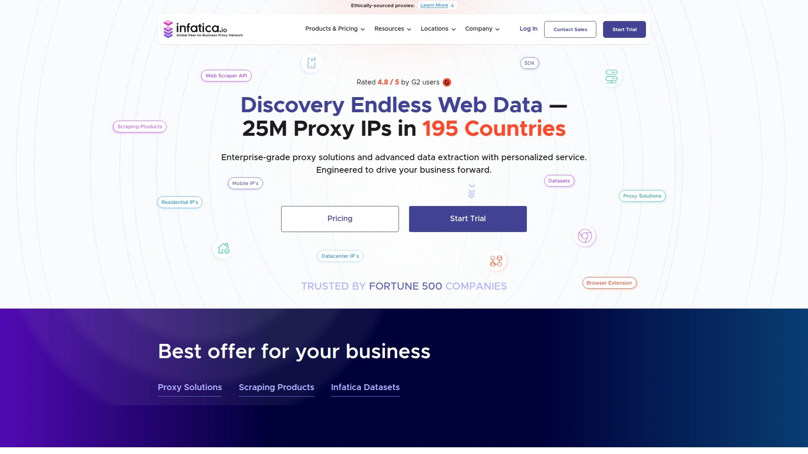

Infatica structures their service around gateway servers positioned between clients and proxy devices, automatically routing traffic through optimal paths. The residential pool covers 15+ million IPs globally with country, region, city, and ISP-level targeting. Their approach emphasizes fresh, non-recycled IPs—you get proxies dedicated to your account rather than shared across multiple users simultaneously.

Residential proxy plans start at $96 for 8GB, scaling to $3,500 for 1TB with volume discounts. All plans include SOCKS5/HTTP protocol support, unlimited concurrent connections, and flexible rotation from 5-60 minutes or sticky sessions. The dashboard generates lists of up to 1,000 proxies per configuration with customizable authentication methods. Public APIs enable programmatic control over traffic usage, locations, and available ISPs.

Mobile proxies use the same gateway infrastructure, providing real mobile device IPs with identical rotation options and targeting granularity. Response times average 0.4 seconds—faster than most residential proxy services. Success rates consistently hit 99.9% uptime based on their monitoring.

Infatica positions as an enterprise solution with 24/7 support responding within 4-hour SLAs, often faster in practice. Documentation walks through setup flows comprehensively with integration samples for common languages and frameworks. The main limitation is traffic statistics—you get bandwidth consumption data but not detailed metrics like per-request success rates or target-specific performance that some competitors provide.

## **[ProxyEmpire](https://proxyempire.io)**

Self-service platform with 9.5 million IPs and unlimited bandwidth rollover.

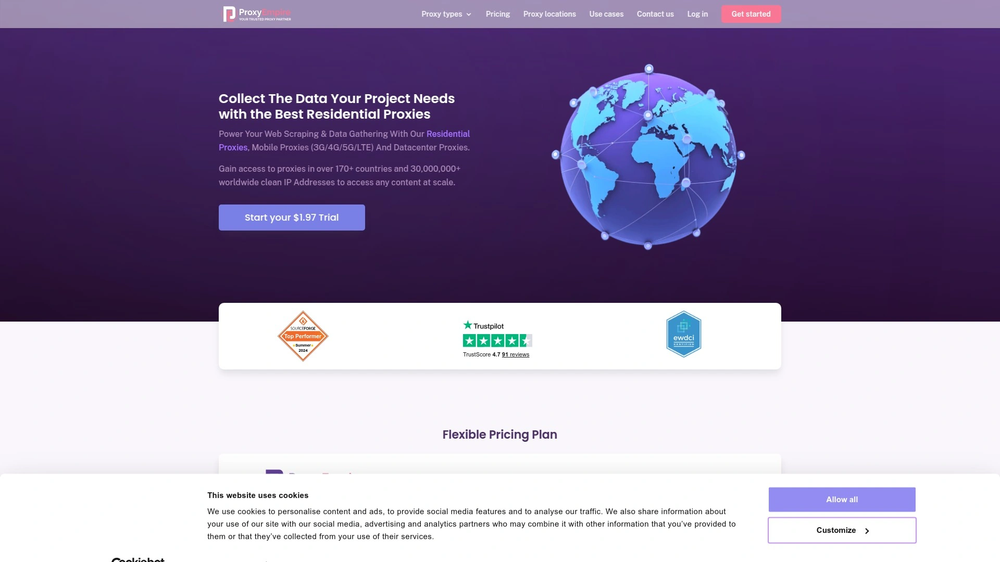

ProxyEmpire operates as a mid-market generalist covering residential, mobile, datacenter, and static residential proxies across 170+ countries. Their differentiator is unlimited bandwidth rollover—unused traffic automatically carries forward indefinitely rather than expiring monthly. This eliminates the "use it or lose it" pressure that inflates costs on competing platforms.

The residential network includes 9.5 million IPs with targeting by country, region, city, and ISP. Pricing starts at $3.50/GB with a $1.97 trial option. Mobile proxies provide 4G network access for mobile-specific scraping. Static residential proxies offer dedicated IPs with unlimited bandwidth for consistent identity requirements. Performance shows 99.9% uptime with fast connection speeds suitable for high-volume operations.

Their proxy manager interface provides visual organization of proxy pools by purpose or region, automatic or manual IP rotation, connection monitoring, and sticky session configuration. Browser extensions for Chrome simplify setup for less technical users. The platform integrates smoothly with automation tools, bots, and scraping frameworks through standard HTTP/SOCKS5 protocols.

ProxyEmpire participates in the Ethical Web Data Collection Initiative and emphasizes proper IP sourcing, though specific acquisition methods aren't detailed publicly. User reviews highlight the value proposition—solid performance at mid-tier pricing with customer support available via live chat and email. For teams wanting reliable infrastructure without premium pricing or complex configurations, ProxyEmpire delivers balanced capabilities.

## **[Massive](https://www.joinmassive.com)**

100% ethically-sourced residential proxies with AppEsteem certification and performance-leading benchmarks.

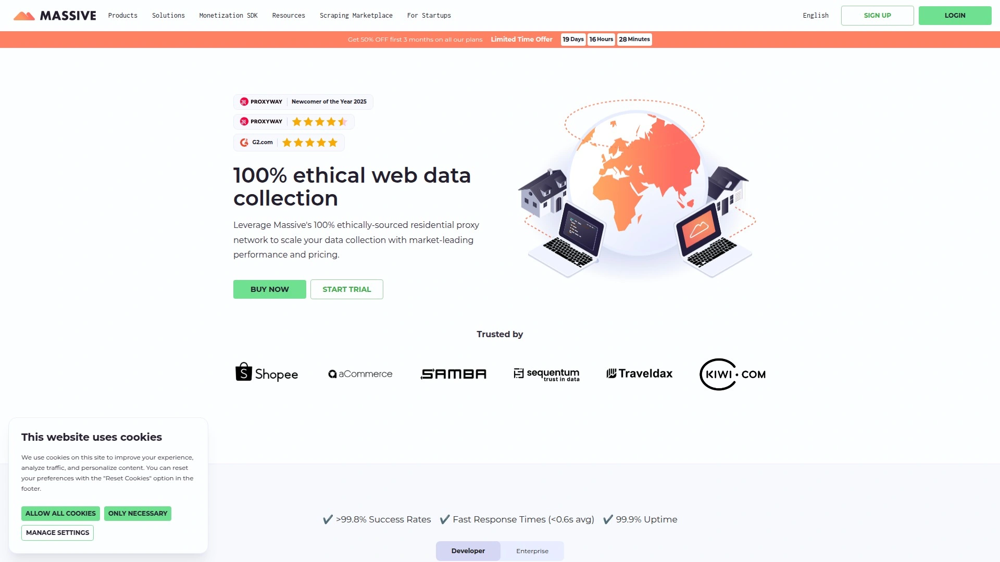

Massive launched in 2024 with a clear differentiation strategy: complete transparency in IP sourcing backed by third-party certification. Every IP comes from their SDK installed on user devices with explicit opt-in consent—no ambiguity about IP origins or consent mechanisms. AppEsteem certification provides external validation that their data collection meets rigorous ethical standards.

Performance metrics set them apart. Testing shows 100% success rates on Google for ISP proxies, 98.03% on Amazon, with average ISP latency of just 0.09 seconds—fastest in class. Residential proxies achieved 0.6-second response times with 99.8% success rates. The network spans 195+ countries with city, state, and ZIP code targeting. Sticky sessions run 1-60 minutes with user control.

Pricing starts at $3.99/GB with bandwidth rollover—unused traffic carries forward rather than expiring. This value-oriented approach contrasts with their premium performance positioning. They support HTTP/HTTPS and SOCKS5 protocols with unlimited concurrent connections and multi-user API access. The dashboard is deliberately simple for fast setup without feature bloat.

Why Massive matters: AI training data provenance is becoming a compliance battleground. Having verifiably ethical data sources reduces legal exposure as regulations tighten. Their technical performance matches or exceeds providers charging significantly more. For AI labs, ethical enterprises, or anyone needing defensible data sourcing documentation, Massive offers unique value.

## **[Webshare](https://www.webshare.io)**

Budget datacenter specialist expanding into residential proxies with self-service emphasis.

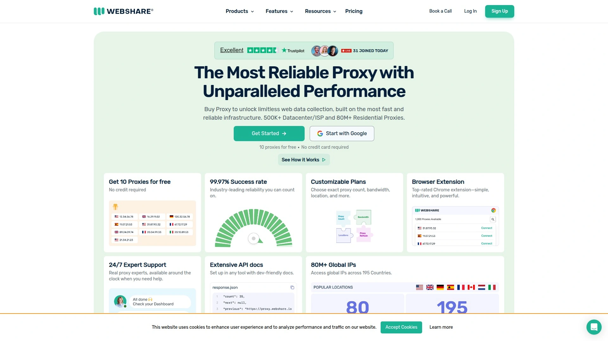

Webshare built their reputation on affordable datacenter proxies before expanding into residential and ISP offerings. The datacenter pool includes 400,000 IPs across 40 locations with unlimited bandwidth and 99.7% uptime. Residential proxies cover 80 million IPs across 195 countries, starting at $3.50/GB with a 50% discount available. Static residential proxies begin at $0.30/IP.

Their value proposition centers on self-service ease and transparent pricing. The free plan provides 10 proxies with 1GB/month indefinitely—genuinely useful for testing or light usage. Paid plans scale clearly with volume discounts and customizable options. The dashboard offers real-time performance tracking, automated IP rotation, and straightforward proxy list generation.

Infrastructure testing shows 99.58% success rates with 1.49-second response times for residential proxies—middle of the market. The system supports HTTP and SOCKS5 protocols with country-level targeting (city targeting not yet available for residential). Email and chat support operates 11PM-11AM PST, which works for US-based teams but leaves gaps for international users.

Webshare's limitations are feature depth. Advanced capabilities like ASN targeting or custom rotation intervals are absent or limited compared to full-featured competitors. But their pricing transparency and genuinely free entry tier make them accessible for developers and small teams exploring proxy infrastructure without upfront investment.

## **[Proxy-Seller](https://proxy-seller.com)**

Flexible provider with per-IP and per-GB pricing across all major proxy types.

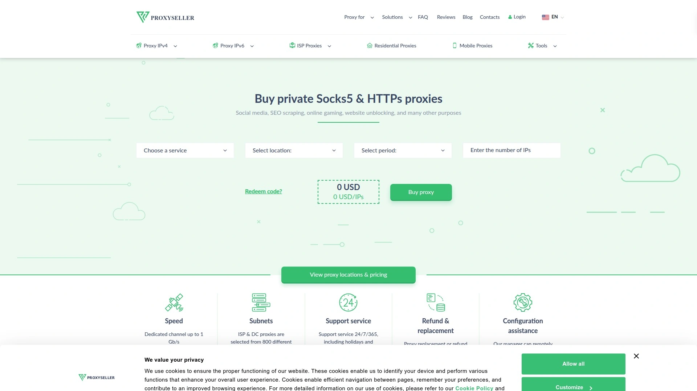

Proxy-Seller operates with unusual flexibility—you can purchase as few as one proxy or scale to thousands, with prices varying by location and duration from weekly to annual subscriptions. Their residential pool includes 500,000+ IPs with 150,000+ in the United States. Mobile, ISP, and datacenter proxies round out the product line.

Testing shows residential proxies achieved 98% success rates with fast response times rivaling premium providers. The infrastructure remained stable throughout benchmark periods with consistent uptime. Mobile proxies provided solid performance across social media and ecommerce platforms. ISP proxies from major US providers like Lumen demonstrated strong residential classification in IP databases.

Pricing complexity is both benefit and burden. Individual ISP proxies might cost $1-3 per month depending on location and contract length, with England 3x more expensive than Ukraine. Residential proxies are metered by bandwidth with packages from 1GB upward. You only pay for valid IPs used. The dashboard lists available IPs with status, expiration, and export options in various formats.

Support stands out in reviews—users consistently praise rapid IP replacements when problems arise and helpful assistance from named support staff. The proxy management interface is functional but basic, without advanced analytics beyond traffic consumption. For users wanting maximum pricing flexibility and direct control over individual IPs rather than gateway-style access, Proxy-Seller provides unusual granularity.

## **[Hydraproxy](https://hydraproxy.com)**

Budget residential and mobile proxies with daily/weekly plans.

Hydraproxy targets price-sensitive users with flexible short-term plans uncommon in the market. Pricing runs $5/GB for 1-50GB, $4/GB for 50-150GB, and $3/GB for 150GB-1TB. Daily, 3-day, and 7-day rental options provide extreme flexibility for project-based scraping or testing scenarios. The pool spans 5+ million residential IPs with mobile proxy options.

Their approach emphasizes granular control and affordability rather than premium performance. Testing shows 80% average success rates on ecommerce platforms—adequate but behind market leaders. Speed performance varies by proxy, with some delivering fast connections and others requiring higher ping times. Connection stability showed some errors but generally maintained usability.

The interface includes automatic proxy rotation, sticky session configuration, and standard authentication methods. Mobile proxies from 4G networks provide higher trust scores for mobile-focused scraping. Support operates via live chat, email, and social media with generally responsive handling of issues.

Hydraproxy won't compete with premium providers on raw performance metrics. But the combination of very competitive pricing, short-term rental flexibility, and adequate reliability makes it workable for budget-constrained projects or testing workflows before committing to more expensive infrastructure.

## **[PacketStream](https://packetstream.io)**

Peer-to-peer residential proxy network with simple $1/GB pricing.

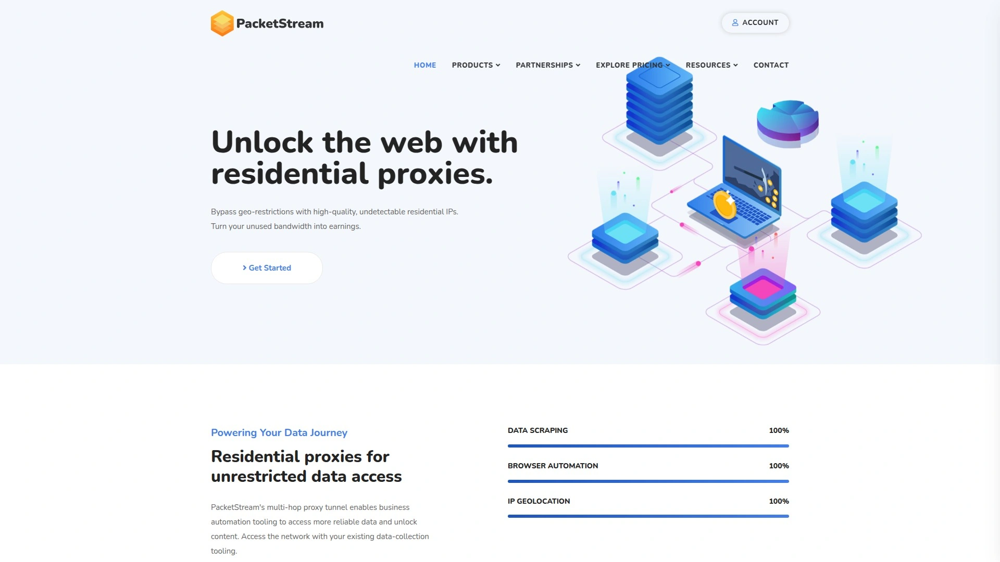

PacketStream operates a P2P model where individuals share unused bandwidth in exchange for payment, creating a residential proxy network from real household connections. Pricing is straightforward: $1 per GB with no contracts or hidden fees. You only pay for bandwidth consumed, making it cost-effective for variable workloads.

The network provides country-level geo-targeting across global locations. Proxies automatically rotate or can maintain static sessions depending on configuration. The residential nature of IPs helps bypass geo-restrictions and reduces detection compared to datacenter proxies. Support includes documentation for setup across various tools and programming languages.

Performance and IP pool size aren't published at the scale of enterprise providers, positioning PacketStream more toward individual developers and small teams. The peer-to-peer model means IP availability fluctuates based on how many users are actively sharing bandwidth. This introduces variability absent from providers operating their own infrastructure.

The value proposition is pricing simplicity and low barrier to entry. If you need residential proxies without complex plans or large minimum purchases, PacketStream provides accessible infrastructure. Enterprise teams requiring guaranteed uptime SLAs and dedicated support should look elsewhere, but for exploratory projects or moderate-scale scraping, the model works.

## **[GeoSurf](https://www.geosurf.com)**

Premium residential and mobile proxies with precise geo-targeting and location testing tools.

GeoSurf provides 3.7 million residential IPs across 2,000+ cities globally with emphasis on location-specific testing and verification. Their infrastructure supports country, city, and ISP-level targeting with static IPs available for consistent testing environments. Mobile proxies deliver real mobile device IPs with dynamic rotation for mobile-focused scraping and ad verification.

Pricing starts at $300 for 25GB for mobile proxies and $300 for 37.5GB for residential, positioning them at the premium tier. Enterprise and SMB plans scale with consumption, offering better per-GB rates at higher volumes. The platform includes full page screenshot capabilities for capturing geo-targeted content and data collection APIs for scheduled or real-time extraction.

Features include sticky IP sessions configurable from 0 to 10 minutes, ASN-level targeting for specific ISP testing, and authentication via username/password. Response times are fast with low latency connections suitable for high-efficiency operations. The interface provides worldwide location presets and customizable geolocations.

GeoSurf targets enterprises with significant data collection needs, particularly those requiring high-quality, location-specific IPs for market research, ad verification, or localized testing. Their higher pricing reflects focus on business users prioritizing reliability over cost optimization. Smaller teams or budget-conscious projects will find better value elsewhere.

## **[Froxy](https://froxy.com)**

Global proxy provider with cryptocurrency payment options and 10 million IP pool.

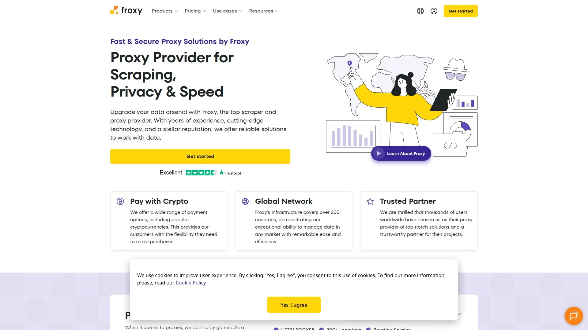

Froxy operates infrastructure covering 200+ countries with over 10 million residential IPs. Residential proxies start at $2.69/GB, mobile proxies at $3.90/GB, and datacenter proxies at $0.60/GB. They accept cryptocurrency payments alongside standard methods, providing transaction privacy for users preferring that option.

The platform includes SERP scraping APIs starting at $1.32 per 1,000 requests and ecommerce scraping tools at identical pricing. HTTP/SOCKS5 protocol support enables integration with various scraping frameworks and automation tools. Targeting operates at country, region, and city levels with ISP filtering available.

User reviews on G2 give Froxy 4.7/5 ratings, praising proxy location variety, fast connections, and customer support responsiveness. The dashboard manages proxy configuration, traffic monitoring, and subscription settings. Documentation covers integration examples and use case guides.

Froxy positions in the mid-market segment—not the cheapest but competitive on pricing while maintaining reasonable performance and support standards. For teams needing global coverage without premium pricing, Froxy delivers balanced capabilities. The crypto payment option differentiates them for users prioritizing payment anonymity.

## **[922 S5 Proxy](https://www.922proxy.com)**

Large-scale residential proxy pool with 200 million IPs and flexible pricing models.

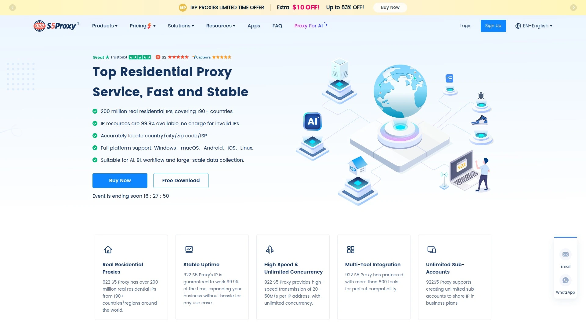

922 S5 Proxy operates one of the industry's largest advertised proxy pools at 200+ million residential IPs covering 190+ countries. Pricing offers both IP-based and bandwidth-based models: dynamic proxies start at $0.04/IP or $0.8/GB, while static ISP residential proxies begin at $0.28/IP/day. Volume discounts scale significantly.

The service provides free proxy software with simple deployment taking seconds to configure. Authentication supports both username/password and API access. Protocols include SOCKS5, HTTP, and HTTPS with targeting by country, city, ZIP code, and ISP. You're only charged for valid IPs—invalid ones don't count against usage.

Features include automatic rotation, sticky sessions, and browser extension support for Chrome and Firefox. The platform integrates with anti-detection browsers commonly used for multi-account operations. Use cases span data collection, social media marketing, ad verification, brand protection, SEO, and ecommerce operations.

Reviews show mixed feedback—Trustpilot rating sits at 4.0 with some users praising link speed and service reliability while others report issues with proxy quality and customer support responsiveness. The massive IP pool provides scale, but quality consistency appears less predictable than established enterprise providers. For high-volume operations where absolute top-tier quality isn't critical, the pricing and scale merit consideration.

---

## Common Questions

**How do residential proxies differ from datacenter proxies for web scraping?**

Residential proxies use real IP addresses from household internet connections, making them appear as genuine users to target websites. This significantly reduces blocking and CAPTCHA rates but costs more per GB. Datacenter proxies originate from servers in data centers—they're faster and cheaper but websites detect and block them more aggressively. Choose residential for high-security targets like Amazon or Google, datacenter for public data or less restrictive sites where speed matters more than stealth.

**What proxy pool size do I actually need?**

Pool size matters less than you'd think for most scraping operations. A 1 million IP pool often suffices if IPs rotate properly and aren't heavily recycled. What really counts: how quickly IPs get blocked on your specific targets, rotation frequency, and concurrent request volume. Premium providers with smaller pools often outperform budget services with massive but heavily-shared pools. Test against your actual targets—a 10 million IP pool performing at 98% success beats a 100 million pool with 85% success.

**Should I prioritize speed or success rate?**

Success rate trumps speed for serious data collection. A fast proxy that gets blocked 20% of the time forces you to build extensive retry logic, wastes bandwidth on failed requests, and might miss time-sensitive data. A slower proxy with 99%+ success rates completes jobs reliably with simpler code. That said, sub-1-second response times materially impact large-scale operations. Target providers delivering both—several on this list maintain 99%+ success with under 0.6-second response times.

---

## Final Thoughts

The proxy landscape in 2025 rewards knowing what you actually need. AI teams training models can't compromise on ethical sourcing—[Thordata](https://www.thordata.com) and Massive deliver verifiable consent and performance. Enterprise operations requiring maximum reliability across every geo find value in Oxylabs or Bright Data despite premium pricing. Budget-conscious teams get remarkable capability from Decodo or IPRoyal without sacrificing core functionality.

Your choice hinges on scraping volume, target difficulty, budget constraints, and whether you're building infrastructure internally or want turnkey solutions. Thordata's combination of AI-optimized infrastructure, competitive pricing, and geographic breadth positions it strongly for modern data collection workflows where speed and stability directly impact model training costs or business intelligence timeliness.
